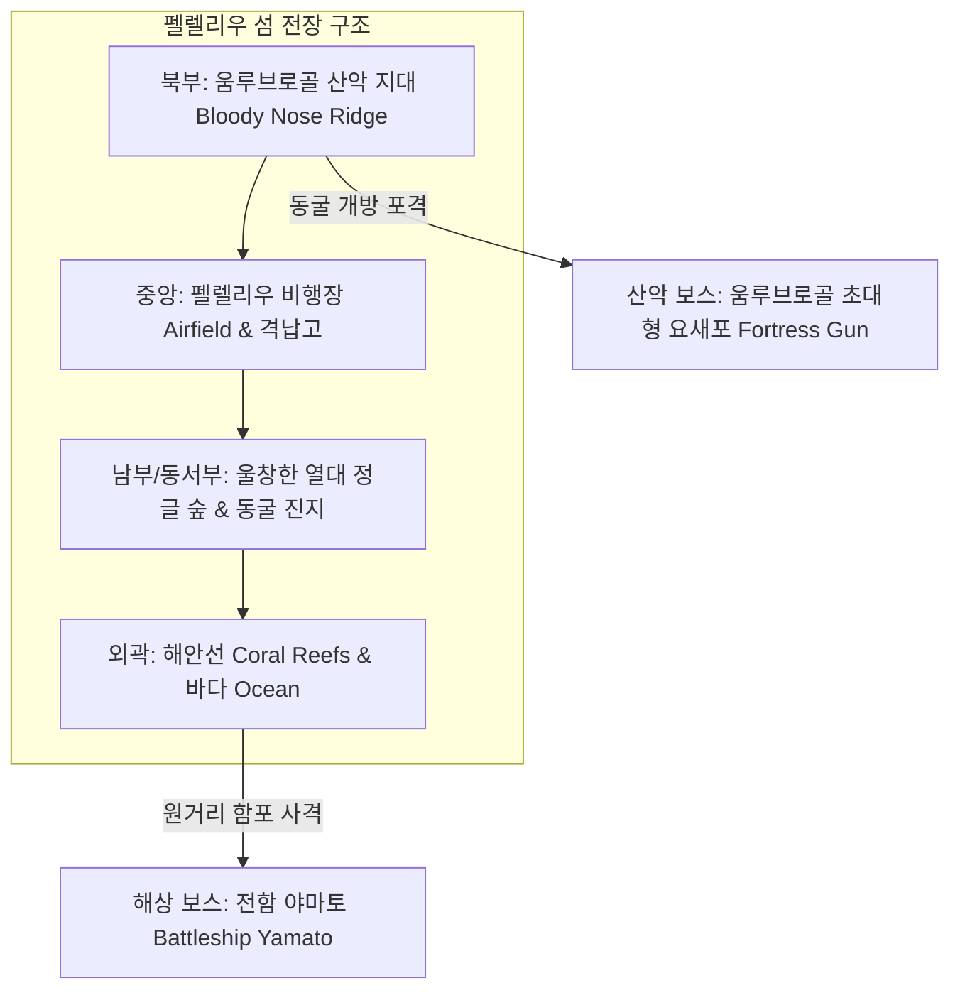
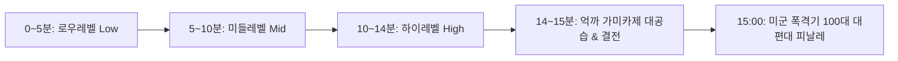

# 🐍 [프로젝트 기획서/PRD] 강철의 우로보로스: 펠렐리우 1944 (Project Iron Serpent: Peleliu 1944)
> **태평양 전쟁기 펠렐리우 섬, 800mm 구스타프와 대공화기를 두른 거대 강철 뱀의 상륙 서바이벌**

---

## 1. 프로젝트 개요 (Overview)

### 1.1. 비전 & 슬로건
> **"15분의 카운트다운, 가미카제가 쏟아지는 지옥의 섬에서 버텨내라! 800mm 구스타프와 새끼 뱀들이 요새를 찢고, 마침내 하늘에서 200대의 연합군 대편대가 지옥을 덮으리라!"**

본 게임은 **1944년 태평양 전쟁 최대의 격전지 중 하나인 '펠렐리우 섬(Peleliu Island)'**을 무대로 합니다.
플레이어는 미군의 비밀 결전 병기이자 전함 수준의 장갑과 거포를 두른 거대 사이버네틱 괴수 **[강철의 뱀 (Iron Serpent)]**이 되어, 사방이 바다로 둘러싸인 고립된 섬에 상륙합니다. 

섬 곳곳에 깔린 욱일기 막사, 동굴 포좌(토치카), 치하 전차와 가미카제 자살 특공대의 파상공세를 뚫고, **상단 중앙의 제한 시간(15분)까지 철벽처럼 버텨내어 연합군 중폭격기 대편대의 융단폭격을 유도하는 것**이 최종 목표입니다.

### 1.2. 기본 정보
* **장르**: 2차대전 대체역사 스네이크 탄막 서바이벌 + 요새 파괴 로그라이트
* **배경 무대**: 1944년 9월 팔라우 제도 펠렐리우 섬 (Peleliu Island)
* **타깃 플랫폼**: PC (Steam, itch.io, Steam Deck 완벽 호환) 및 모바일
* **개발 엔진**: Godot Engine 4.x (2D CanvasItem, GL Compatibility 렌더러)
* **런 타임**: **15분 고정 카운트다운** (15:00 ➔ 00:00)

---

## 2. 전장 맵 명세: 펠렐리우 섬 (The Isolated Island)

맵은 무한 평지가 아니라, **4면이 바다로 둘러싸인 고립된 하나의 거대한 섬**입니다.

### 2.1. 지형 구성 & 역사적 고증 디테일
1. **사면의 해안선 & 얕은 바다 (Coral Reef Ocean Roaming)**:
   * 뱀은 육상에만 갇혀있지 않고, **해안선 밖의 에메랄드빛 얕은 바다(산호초 여울)까지 어느 정도 자유롭게 헤엄쳐 나갈 수 있음** (수륙양용 기동).
   * 해상에서 밀려오는 적들을 바다에서 요격하거나, 육상의 포위망을 피해 해상으로 우회 기동하는 전술적 자유도 제공.
   * 지나치게 깊은 심해로 나가지 못하도록 심해 조류 경계선이 부드럽게 복귀시킴.
2. **울창한 열대 정글 숲 (Dense Jungle)**:
   * 펠렐리우 특유의 빽빽한 야자수와 맹그로브 숲.
   * 뱀의 몸체나 새끼 뱀들이 지나가면 나무들이 짓밟혀 쓰러지며 통로 개척.
3. **중앙 펠렐리우 비행장 (The Airfield)**:
   * 2개의 교차형 아스팔트 활주로, 폭격당한 격납고(Hangar), 부서진 관제탑.
   * 장애물이 적어 기동이 자유롭지만, 적의 탄환과 가미카제의 표적이 되기 쉬운 격전지.
4. **북부 움루브로골 산악 지대 (Bloody Nose Ridge)**:
   * 험준한 산호석 절벽과 500여 개의 미로 같은 동굴 진지망.
   * 산악 지대 중심부에는 첫 번째 보스인 **[움루브로골 초대형 요새포]**가 잠복.

---

## 3. ✈️ 1분 주기 연합군 250대 대편대 무차별 융단폭격 (Allied Air Supremacy)
* **초토화 전술 (Scorched Earth Carpet Bombing)**:
  * 엔딩뿐만 아니라, **인게임 매 1분(60초)마다 연합군 250대 대항공군단이 섬 상공을 휩쓸며 무차별 융단폭격을 감행**합니다.
* **대편대 구성 (총 250대)**:
  * **F4U 콜세어 / P-51 머스탱 전투기 100대**: 초저공 기총소사.
  * **B-29 슈퍼포트리스 / B-17 4발 중폭격기 100대**: 수천 발의 고폭탄 투하.
  * **F4U / P-47 전폭기 50대 (신규 추가)**: 지상 토치카와 요새를 향한 중로켓 및 500파운드 폭격.
* **전장 파괴 연출**:
  * 60초 타이머가 끝나는 순간 상단에 **[💥 250대 연합군 대편대 공습 중!]** 배너가 점등.
  * 전장 전체가 6초 동안 화염 폭풍으로 뒤덮이며, **화면 상의 몬스터 80~90%가 일제히 폭사**하고 욱일기 막사들이 무너지며 대량의 보급품 방출!
  * 플레이어 뱀은 철벽 장갑으로 폭격을 버텨내며, 폭격이 쓸고 간 전장의 전리품을 폭식하는 카타르시스 이벤트.

### 2.2. 리스폰형 적 거점 (포좌 & 막사)
* **욱일기 막사 (Barracks)** & **토치카 포좌 (Bunkers & Pillboxes)**:
  * 섬 전역에 수십 개 분산 배치.
  * 이곳에서 보병, 장갑차, 전차가 끊임없이 증원 쏟아져 나옴.
  * **15초 부활 메카닉**: 뱀이 몸체나 중포로 파괴하면 폭발하며 대량의 보급품을 드롭하지만, **15초 뒤 지하 갱도에서 재건축(부활)**되어 다시 병력을 배출함. 끊임없이 진지를 순회하며 파괴해야 하는 루프 형성.

---

## 3. 플레이어 병기: [강철의 뱀] 무장 & 메카닉

### 3.1. 압도적 맷집 & 단계적 스케일 거대화 (Iron Armor & Staged Growth)
* **철벽 장갑 (Ironclad Armor)**:
  * 웬만한 소총탄이나 기관총 세례는 "도탄(Ricochet!)" 튕겨내며 데미지를 거의 입지 않음.
  * 다만 포탄 직격, 전차 철갑탄, **가미카제 자살 폭탄**에는 확실한 피해를 입으며 서서히 내구도가 닳음.
* **단계적 거대화 (Staged Scale Growth)**:
  * 적과 진지를 파괴하고 드롭되는 **[군수 보급품(Supply Crates)]**을 수집.
  * 기하급수적이 아닌, **정해진 임계치(Tier 1 ➔ Tier 2 ➔ Tier 3 ➔ Tier 4)**에 도달할 때마다:
    * 뱀의 머리와 몸통 마디의 **두께와 크기(Scale)가 1.3배, 1.6배, 2.0배로 묵직하게 거대화**.
    * 탑재되는 포탑 구경 업그레이드 및 새끼 뱀 사출 수량 증가.

### 3.2. 거대 함포 & 열차포 화망 (Arsenal of Demolition)
뱀의 머리와 마디 위에 실제 2차대전 전설의 거포들이 탑재됩니다:

| 구경 / 무장명 | 장착 위치 및 수량 | 공격 방식 & 사운드 특성 | 역할 및 타깃 |
| :--- | :--- | :--- | :--- |
| **30mm 쌍발 대공기관포** | 뱀 몸통 전역 (수십 개) | 초당 15발 난사, 찌르는 듯한 대공 연사음 | **가미카제 전투기 요격 최우선**, 잔여 보병 소탕 |
| **50mm 쌍발 속사포** | 전방/후방 마디 4문 | 0.8초 주기 점사, 날카로운 포성 | 경장갑차 및 트럭 관통 타격 |
| **150mm 중포 (Howitzer)** | 몸통 중앙 2문 | 2.0초 주기 고폭탄, 묵직한 중포성 | 중전차 및 토치카 포좌 철거 |
| **300mm 쌍발 중포 (Twin Heavy)** | 대형 마운트 1문 | 3.5초 주기 일제 사격, 고막을 찢는 함포성 | 대형 구조물 및 보스 집중 타격 |
| **800mm 구스타프 열차포 (Schwerer Gustav)** | 뱀 등 중앙 거대 주포 | 6.0초 주기 초대형 철갑탄, **전 화면 진동 + 핵폭발급 굉음** | 경로 상의 모든 것을 증발시키는 최종 결전포 |

### 3.3. 스마트 오토 타겟팅 AI (가미카제 최우선 일제 사격)
* 평상시: 각 포탑이 사거리 내의 지상 유닛(보병, 전차, 막사)을 자유 분산 타격.
* **비상 경보 발령 시 (가미카제 출현 / 보스 조준)**:
  * 사이렌 소리와 함께 가미카제기가 급강하해 오면, **뱀에 달린 수십 문의 30mm 대공포와 중포들이 즉시 가미카제기를 향해 포구를 돌려 [초집중 일제 사격(Focus Fire)]** 개시!

### 3.4. 새끼 뱀 무리 (Brood Serpents) - 지형 & 장애물 제압
* 어미 뱀의 마디에서 주기적으로 수십 마리의 강철 새끼 뱀들이 사출됨.
* **장애물 돌파 (Breach)**: 플레이어 뱀이 지나가기 어려운 철조망, 바위, 토치카 틈새로 파고들어 내부 폭파.
* **적 결박 (Pin Down)**: 전차 궤도와 보병의 발목을 칭칭 감아 이동을 멈추게 함.
* **스마트 루팅**: 맵 전역의 보급품/탄약 상자를 물어 어미 뱀에게 배달.

---

## 4. 적 유닛 구성 & 3단계 레벨 티어 (Enemy Waves)

시간 경과에 따라 적의 무장과 공세 수위가 파괴적으로 상승합니다:

### 4.1. 로우 레벨 (00:00 ~ 05:00) - 보병의 파상공세
* **일본군 소총수**: 38식 아리사카 소총 사격.
* **반자이 돌격대**: 군도를 빼어 들고 함성("덴노 헤이카 반자이!")과 함께 폭탄을 품고 육탄 돌격.
* **기관총 진지**: 92식 중기관총으로 지속 탄막 형성.

### 4.2. 미들 레벨 (05:00 ~ 10:00) - 기계화 및 경전차 부대
* **95식 경전차 '하고' (Ha-Go)**: 기동성이 높으며 37mm 포 사격.
* **장갑 트럭 & 대포 견인차**: 이동형 야포를 끌고 와 원거리 포격.
* **대전차 자폭 보병**: 뱀 몸통 밑으로 기어들어와 자폭 시도.

### 4.3. 하이 레벨 (10:00 ~ 15:00) - 중전차 군단 & 억까 가미카제
* **97식 중전차 '치하' (Chi-Ha Kai)**: 47mm 고속 전차포로 뱀의 장갑에 직격타.
* **★ [억까 유닛] 가미카제 자살 폭탄 비행기 (Zero-sen Kamikaze)**:
  * 상공에서 **스투카 제리코의 나팔 같은 소름 끼치는 급강하 사이렌**을 울리며 플레이어를 향해 자폭 다이브!
  * 회피 불가급 속도로 내리꽂히며, 격추하지 못하고 충돌 시 뱀의 체력을 한 번에 30~40% 날려버리는 살인적 위력.
  * 뱀의 30mm 대공포 집중 사격으로 공중 분해시켜야만 생존 가능.

---

## 5. 전장 보스 2종 (Epic Boss Encounters)

### 5.1. [보스 1] 움루브로골 초대형 동굴 요새포 (Bloody Nose Fortress Gun)
* **출현 시점**: 07:00 (전투 중반)
* **등장 연출**: 산 중턱의 거대한 위장문이 열리며, 바위산을 통째로 깎아 만든 **초대형 요새포(Fortress Cannon)**가 돌출.
* **공격 패턴**:
  * 산 전체를 흔드는 지진과 함께 전장을 가로지르는 400mm 요새 철갑포 발사.
  * 동굴 미로에서 정예 근위대 무한 출격.
* **공략**: 가미카제보다 위험한 우선 타깃으로 지정되어, 뱀의 800mm 구스타프와 300mm 중포가 일제 집중 포격을 가해 산 자체를 무너뜨려야 함.

### 5.2. [보스 2] 해상 결전 - 전함 야마토 (Battleship Yamato)
* **출현 시점**: 13:00 (피날레 직전)
* **등장 연출**: 해안선 바다 안개를 뚫고 7만 톤급 초대형 전함 **[야마토]**가 부상.
* **공격 패턴**:
  * 460mm 3연장 주포 3기(총 9문)에서 발사되는 전함 일제 사격(Salvo).
  * 섬 전체에 메테오처럼 쏟아지는 초대형 포격 장판.
* **공략**: 해안가로 접근하여 뱀의 구스타프 열차포와 중포로 해상 결전 포격전을 벌여 침몰시켜야 함.

---

## 6. 엔딩 피날레: 미군 200대 대편대의 카펫 바밍 (The Ultimate Victory)

### 6.1. 카운트다운 완료 (00:00 도달)
* 뱀의 체력이 다 닳기 전에 15분을 끝까지 버텨내면 발동.
* 섬 전역의 모든 적과 포탑이 정지하며 하늘이 어두워짐.

### 6.2. 200대 대편대 상공 진입 연출
1. **사운드**: 대지를 뒤흔드는 수백 대의 성형 엔진 굉음(Heavy Radial Engine Roar).
2. **시각 연출**:
   * 전방: **미 해군 F4U 콜세어 & P-51 머스탱 전투기 100대**가 초저공으로 활주로를 쓸어버리며 기총소사.
   * 후방: 하늘을 시커멓게 뒤덮는 **B-29 슈퍼포트리스 & B-17 4발 중폭격기 100대**의 거대한 편대 비행.
3. **카펫 바밍 (융단폭격)**:
   * 수천 발의 500파운드 고폭탄이 섬 전체에 비 오듯 투하.
   * 펠렐리우 섬 전체가 거대한 연쇄 화염 폭풍에 휩싸이며 남아있는 모든 일본군 막사, 동굴, 전차, 보스가 잿더미로 완전 소멸.
   * 폐허가 된 섬 중앙에서 살아남은 [강철의 뱀]이 포효하며 승리(VICTORY) 트로피 달성.

---

## 7. 사운드스케이프 (Sound & Game Feel) 명세

| 사운드 카테고리 | 상세 효과음 사양 |
| :--- | :--- |
| **800mm 구스타프 포성** | 극저음 서브우퍼를 진동시키는 지축을 울리는 대포성 + 지진 소리 |
| **30mm 대공포 사격음** | 쇠사슬을 긁는 듯한 초고속 대공 기관포의 찢어지는 파열음 ("두두두두두두둥-!") |
| **가미카제 급강하음** | **제리코의 나팔 / 사이렌(Jericho Siren)** 특유의 소름 끼치는 고음 급강하 비명소리 |
| **일본군 음성 & 함성** | 보병 돌격 시 외치는 "반자이(万歳)!" 함성과 소총 격발음 |
| **기갑 사운드** | 95식/치하 전차의 삐걱거리는 무한궤도 쇳소리와 디젤 엔진 배기음 |
| **피날레 융단폭격** | 수백 대의 폭격기 편대 엔진음 + 전 화면을 뒤흔드는 연쇄 고폭탄 폭발음 |

---

## 8. 개발 마일스톤 (Milestones)

### 🚩 Phase 1: 펠렐리우 섬 맵 & 거대화 스네이크 + 중포/대공포 화망 (현재 구현 단계)
- [ ] 펠렐리우 섬 맵 구성 (바다 테두리, 중앙 활주로 비행장, 야자수 정글, 욱일기 막사 & 동굴 진지)
- [ ] 뱀 몸체 무장: 30mm 대공포, 150mm 중포, 800mm 구스타프 열차포 렌더링 및 발포 로직
- [ ] 파괴 후 15초 뒤 부활하는 언데드 포좌/막사 오브젝트 구현
- [ ] 새끼 뱀(Snakelings) 사출 및 장애물 파쇄/결박 메카닉 구현

### 🚩 Phase 2: 적 3단계 티어 (보병 ➔ 장갑차 ➔ 전차) & 가미카제 급강하
- [ ] 로우레벨 일본군 보병 (소총수, 반자이 돌격대)
- [ ] 미들/하이레벨 전차 부대 (95식 하고, 치하 전차)
- [ ] **가미카제 자폭 전투기**: 제리코 사이렌과 함께 급강하 자폭 다이브 구현
- [ ] 뱀의 대공포 스마트 집중 사격(Focus Fire) AI 연동

### 🚩 Phase 3: 보스 2종 (산악 요새포 & 전함 야마토) & 15분 타이머
- [ ] 상단 중앙 15:00 카운트다운 타이머 구현
- [ ] 7분 보스: 움루브로골 산악 초대형 동굴 요새포 씬 및 포격 패턴
- [ ] 13분 보스: 해상 전함 야마토 씬 및 460mm 3연장 주포 사격 패턴

### 🚩 Phase 4: 미군 200대 대편대 피날레 & 사운드 마스터링
- [ ] 15:00 카운트다운 종료 시 전투기 100대 + B-29 폭격기 100대 융단폭격 연출 구현
- [ ] 800mm 포성, 대공포 연사음, 가미카제 급강하 사이렌, 반자이 함성 사운드 마스터링
